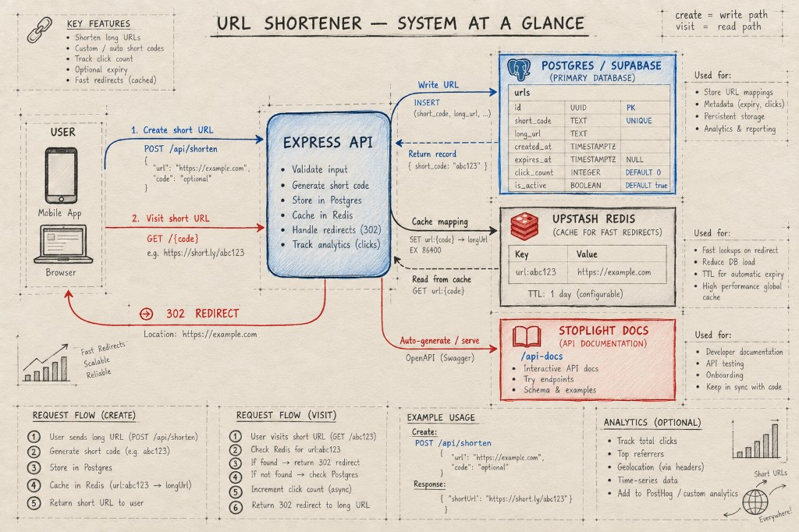
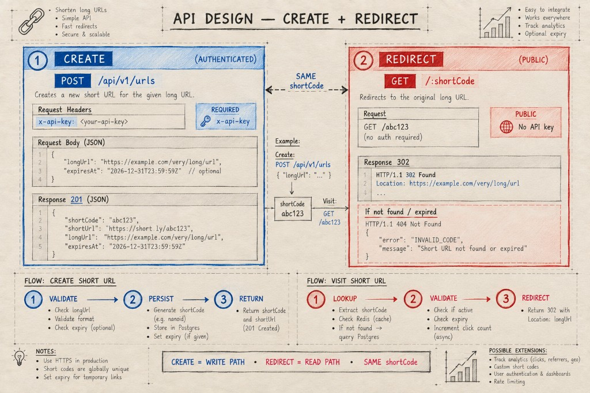
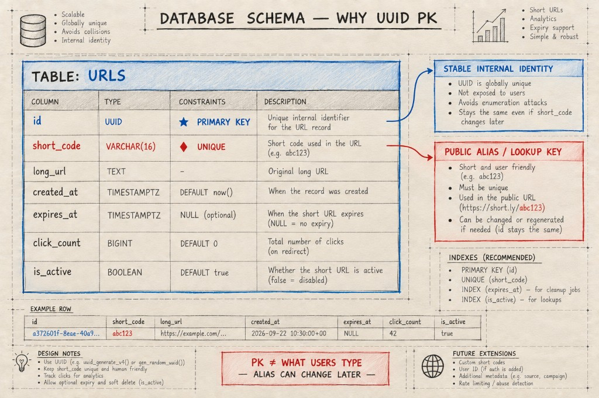
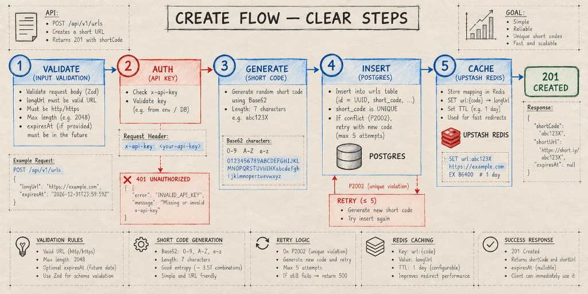
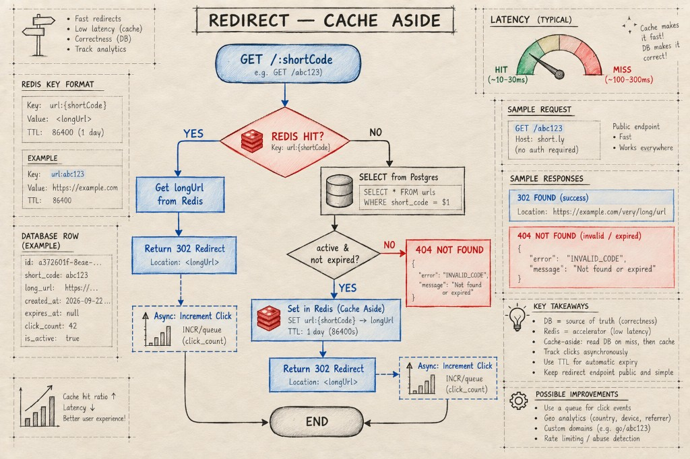
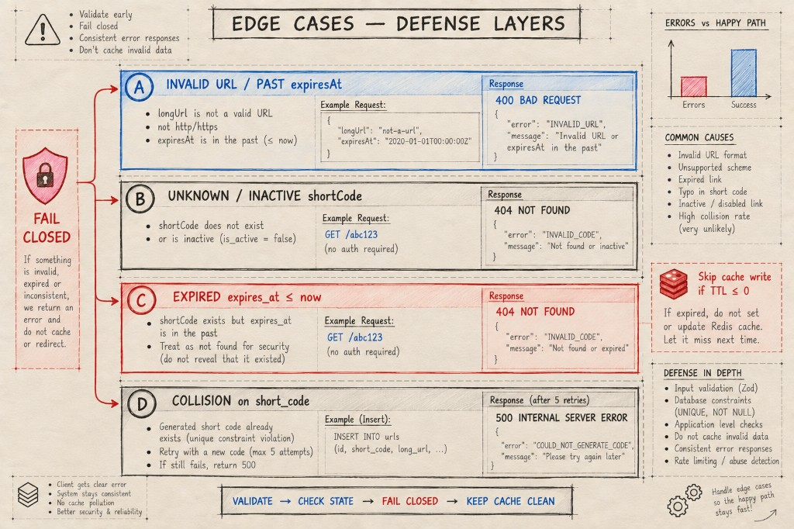
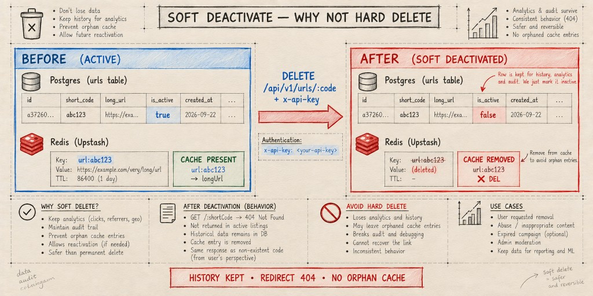
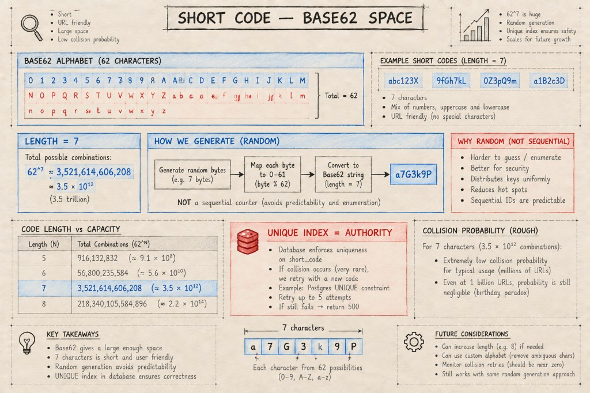
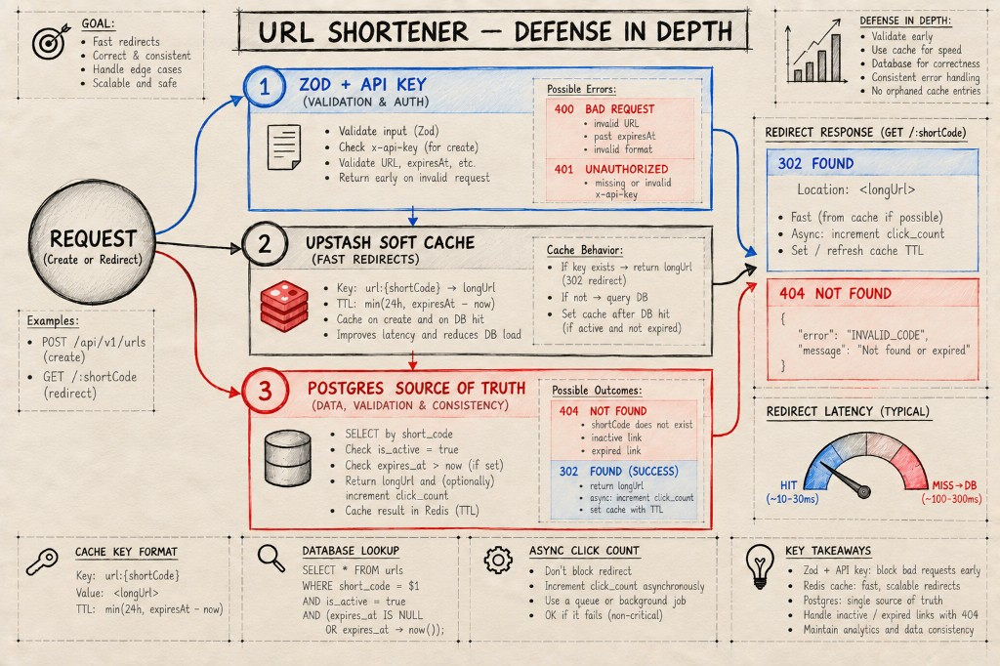
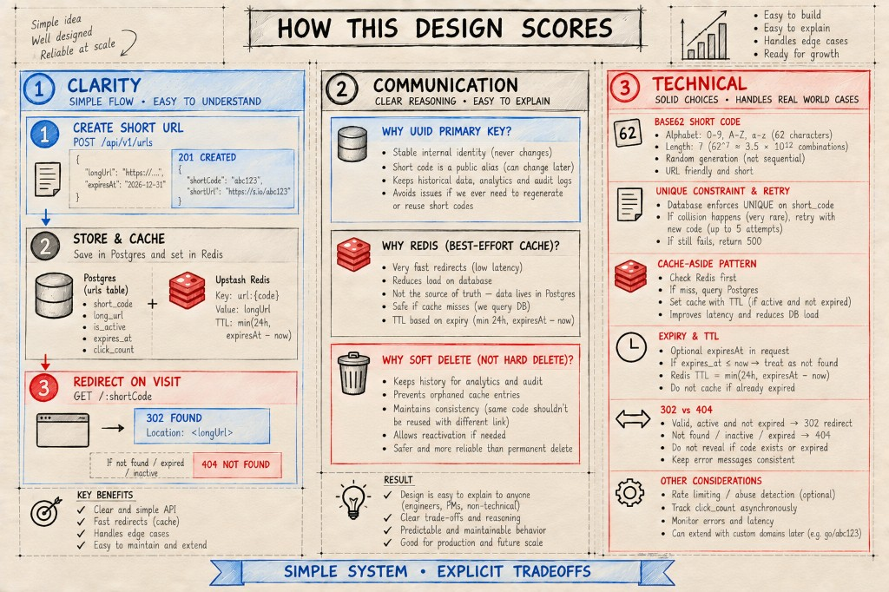

# URL Shortener — Design Diagrams

Copy this whole file into Google Docs / Word, or open it on GitHub while recording.

**Video order (best):** Image 2 → Image 3 → (optional) 4 / 5 / 6 → 10  
**Assignment must-haves:** Image 2 (API) + Image 3 (Database)

Live app: https://slash-w6yj.onrender.com  
Docs UI: https://slash-w6yj.onrender.com/api-docs

---

## Image 1 — System overview



**Talk track:** Client → Express API → Postgres + Redis. Create is write; visit/redirect is read.

> Note when presenting: real create path is `POST /api/v1/urls` with body `{ longUrl, expiresAt? }` (not `/api/shorten`).

---

## Image 2 — API Design (assignment §1) ⭐



### Create short URL
| | |
|---|---|
| **Method** | `POST` |
| **Path** | `/api/v1/urls` |
| **Headers** | `x-api-key`, `Content-Type: application/json` |
| **Body** | `longUrl` (required), `expiresAt` (optional ISO-8601) |
| **Success** | `201 Created` → `id`, `shortCode`, `shortUrl`, `longUrl`, `createdAt`, `expiresAt`, `isActive`, `clickCount` |
| **Errors** | `400` invalid body · `401` missing/invalid API key |

### Redirect / retrieve
| | |
|---|---|
| **Method** | `GET` |
| **Path** | `/:shortCode` |
| **Body** | none |
| **Success** | `302 Found` · header `Location: <longUrl>` |
| **Errors** | `404` unknown / inactive / expired |

**Why:** POST creates a resource (body carries the long URL). GET + 302 is the standard browser redirect pattern.

---

## Image 3 — Database Schema (assignment §2) ⭐



### Table: `urls`

| Column | Type | Notes |
|--------|------|--------|
| `id` | `UUID` | **PRIMARY KEY** |
| `short_code` | `VARCHAR(16)` | UNIQUE public alias |
| `long_url` | `TEXT` | Destination URL |
| `created_at` | `TIMESTAMPTZ` | Default now |
| `expires_at` | `TIMESTAMPTZ` | NULL = never expires |
| `click_count` | `BIGINT` | Default 0 |
| `is_active` | `BOOLEAN` | Soft delete / disable |

**Index:** `UNIQUE (short_code)` for fast redirect lookup.

### Primary key = `id` (UUID), not `short_code`

1. Stable internal identity (never changes)  
2. Public alias stays separate from internal ID  
3. `short_code` remains the unique business key for redirects  

**Tagline:** PK ≠ what users type.

---

## Image 4 — Create flow (clarity)



**Talk track:** Auth gate → validate (`longUrl`) → generate Base62×7 → insert → cache → `201`. Failures: `401`, `400`, collision retry.

---

## Image 5 — Redirect + cache-aside (technical)



**Talk track:** Redis HIT → `302`. MISS → Postgres → check active/expiry → fill cache → `302`. Clicks increment async. DB = truth, Redis = speed.

---

## Image 6 — Edge cases (technical)



**Talk track:** Invalid URL → `400`. Unknown/inactive → `404`. Expired → `404`. Collision → regenerate (UNIQUE is authority). Fail closed; don’t cache bad data.

---

## Image 7 — Soft delete (design choice)



**Talk track:** `DELETE` + API key sets `is_active=false` and deletes Redis key. History kept; redirect becomes `404`. Prefer soft delete over hard delete.

---

## Image 8 — Base62 short codes (data structure)



**Talk track:** Alphabet `0-9A-Za-z` (62). Length **7** ≈ 3.5T space. Random (not sequential) + DB UNIQUE + retry.

---

## Image 9 — Defense in depth (summary)



**Talk track:** Validate early · cache for speed · DB for correctness.

---

## Image 10 — Design summary / closing ⭐



**Closing line:** Create → store/cache → redirect. UUID PK, unique `short_code`, soft delete, cache-aside, clear `302` vs `404`.

---

## Quick copy block (paste into Google Doc without images)

```
URL Shortener — Design

1. API
   POST /api/v1/urls
     body: { longUrl, expiresAt? }
     → 201 { shortCode, shortUrl, longUrl, ... }
   GET /:shortCode
     → 302 Location: longUrl  |  404 if missing/inactive/expired

2. Database (urls)
   id UUID PK
   short_code VARCHAR(16) UNIQUE
   long_url TEXT
   created_at TIMESTAMPTZ
   expires_at TIMESTAMPTZ NULL
   click_count BIGINT
   is_active BOOLEAN

   PK = id because stable internal identity;
   short_code is the public lookup key.
```
